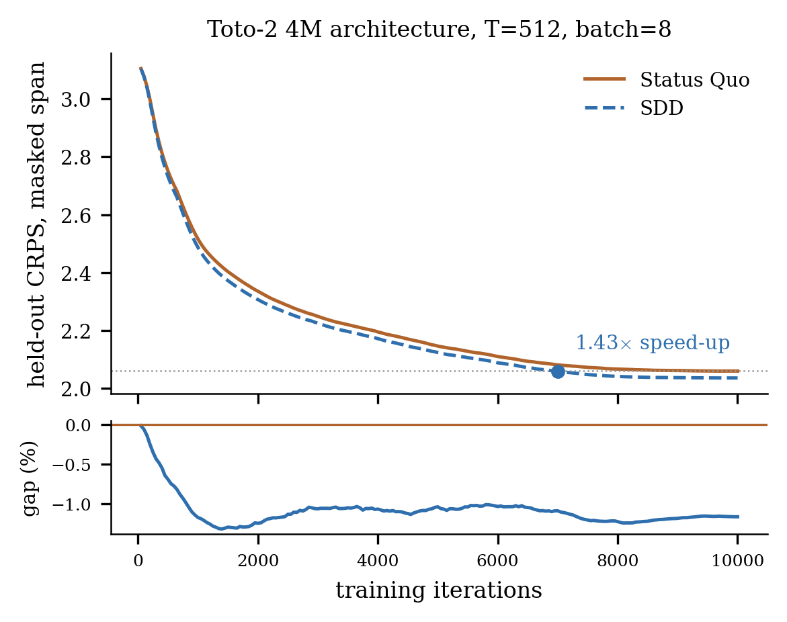

# Synthetic Data Distillation (SDD)

Reference implementation for [*Distillation of Synthetic Data for Time Series
Foundation Models*](https://arxiv.org/abs/2609.09586), and the code that produces Figures 1–3 and Table 4.

Status Quo pre-training scores a forecast against one realized future. SDD scores
it against the **conditional law** of the future, which is closed-form for the
generators used to make synthetic pre-training data. That is a Rao–Blackwellization:
same gradient in expectation, lower variance, faster convergence.

## Install

```bash
pip install -r sdd/requirements.txt   # torch, numpy, matplotlib
python sdd/test_smoke.py          # ~1 min on CPU

# optional: the paper's architectures (Apache-2.0, Datadog)
pip install 'toto-ts @ git+https://github.com/DataDog/toto'
```

## Quickstart

```bash
# 1. cache a corpus (single generator, or a weighted mixture)
python sdd/scripts/make_cache.py --out data/gp --gen gp:1.0 --n 20000 --seq-len 512
python sdd/scripts/make_cache.py --out data/mix --gen gp:0.5 --gen inid:0.3 --gen ou:0.2

# 2. train the two arms
for arm in status_quo sdd; do
  python sdd/scripts/train.py --cache data/gp --out runs/size_cpm/313m/$arm/seed0 \
      --arch toto2 --size 313m --arm $arm --masking cpm --max-steps 20000
done

# 3. render
python sdd/scripts/make_figures.py --runs runs --out figures
```

## Layout

```
sdd/
  dataloader/  generators.py  Generator ABC; GP, linear-Gaussian SSM, OU, GBM, i.n.i.d.
               cache.py       mixture caching, lazy shards, posterior collate
  model/       base.py        TSFM ABC, dispatcher, patched-transformer placeholder
               toto2.py       the five Toto-2 architectures used for the figures
  train/       loop.py        CPM / teacher-forcing training, checkpointing, CSV logs
               losses.py      realized and distilled MSE / pinball; CRPS
  scripts/     make_cache.py  train.py  make_figures.py
  figures.py                  Figures 1-3 and Table 4
  test_smoke.py
```

Each subpackage re-exports its public names, so `from sdd.dataloader import
build_cache`, `from sdd.model import build` and `from sdd.train import Config, train`
are the intended entry points.

### Generators

Each implements `sample` and `posterior` — the conditional mean and std of the future
given a prefix. That second method is the whole interface SDD needs, so adding a
tractable generator means adding one class.

| name | family | conditional law |
|---|---|---|
| `gp` | Gaussian process, 10 kernels | GP conditioning |
| `ssm` | linear Gaussian state space | Kalman filter, then forward propagation |
| `ou` | Ornstein–Uhlenbeck | closed form |
| `gbm` | geometric Brownian motion | closed form in log space |
| `inid` | independent non-identically distributed | future ⟂ history |

Caches store series plus per-series generator parameters, not conditional moments:
moments for an arbitrary context are O(T²) to store but cheap to recompute at batch
time.

### Models

`train.py` only uses the `TSFM` contract — a next-patch predictor where the output
at patch `k` predicts patch `k+1` — so an architecture drops in without touching the
training or loss code. Two are provided:

| `--arch` | sizes | notes |
|---|---|---|
| `toto2` | `4m 22m 313m 1B 2.5B` | **the paper's models.** Configs verbatim from the published `config.json`s, instantiated with random weights so both arms start identical. Needs `toto-ts`. |
| `patched` | `tiny small base large xl` | PatchTST-style placeholder. No optional dependencies; not used for the paper's figures. |

`forward` returns `(pred, loc, scale)`. Toto-2 normalizes internally and reports the
location and scale it used, and the trainer moves targets into that space — where
losses and CRPS are scored. The placeholder returns `loc = 0`, `scale = 1`.

One published Toto-2 field is not architecture-intrinsic: `residual_attn_ratio` depends
on patch count, and every checkpoint ships the value for a 4096-step context. It is
recomputed from the context actually trained on, or the residual stream is mis-scaled.

## A small run on CPU

A CPU-only sanity run: the real `toto2` architecture at size `4m` (4.14M params,
needs `toto-ts` -- see Install), $T = 512$, 10k steps, four seeds. About
35 min per run; each process uses ~750MB at `--batch-size 8`, so run as many in
parallel as your machine's memory allows (all eight at once needs ~6GB free).

```bash
# 164k series = 10k steps x batch 8 x 2 (nothing revisited, with headroom)
python sdd/scripts/make_cache.py --out data/T512 --gen gp:1.0 --n 164000 --seq-len 512

for seed in 0 1 2 3; do
  for arm in status_quo sdd; do
    python sdd/scripts/train.py --cache data/T512 \
        --out runs/small/level/$arm/seed$seed \
        --arch toto2 --size 4m --arm $arm --masking cpm \
        --batch-size 8 --max-steps 10000 --lr 6e-4 --seed $seed --device cpu
  done
done

python sdd/scripts/make_figures.py --only run --run-root runs/small --out figures \
    --run-title 'Toto-2 4M architecture'
```



SDD ends below Status Quo on all four seeds (mean $-1.16\%$, range $-1.33$ to
$-0.99$) and reaches Status Quo's best loss on $1.43\times$ less compute. 


## Reproducing the paper

Five model sizes × two arms × ten seeds × 300k steps. Same pipeline, more compute.

| paper float | command |
|---|---|
| Figure 1 | `sdd/scripts/make_figures.py --only fig1` (no training needed) |
| Figure 2 | runs under `runs/size_cpm/<size>/<arm>/seed<k>/`, `--masking cpm` |
| Figure 3 | runs under `runs/size_tf/<size>/<arm>/seed<k>/`, `--masking tf` |
| Table 4 | runs under `runs/{noise,batch,seqlen}/<level>/<arm>/seed<k>/` |

`figures.py` averages over whatever seeds it finds and truncates to the shortest common
step, so partial sweeps render. **Speed-up** is the compute Status Quo spends to reach
its best masked-span CRPS over the compute SDD needs for the same value. The
observation-noise sweep varies `--noise-std` at cache time, so each level needs its own
cache.


## Testing

`sdd/test_smoke.py` checks the parts that can silently go wrong:

- **posteriors are calibrated** — z-scores of the realized future under each
  generator's conditional law are standard normal;
- **the distilled loss equals the expected realized loss** — against a 20k-draw
  Monte-Carlo estimate, for MSE and pinball. The paper's central claim, and the check
  to run after touching a generator or a loss;
- initialization is seed-paired; caching a mixture, training, resuming;
- Toto-2 builds and trains a step (skipped without `toto-ts`).
